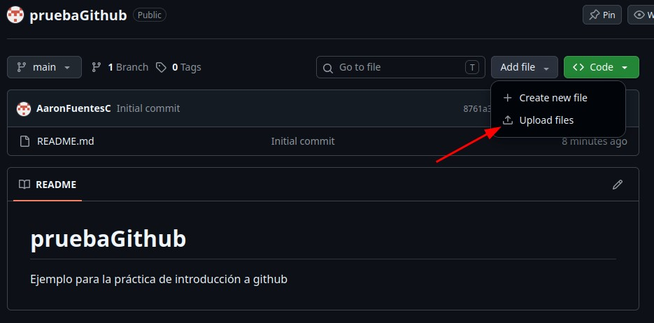
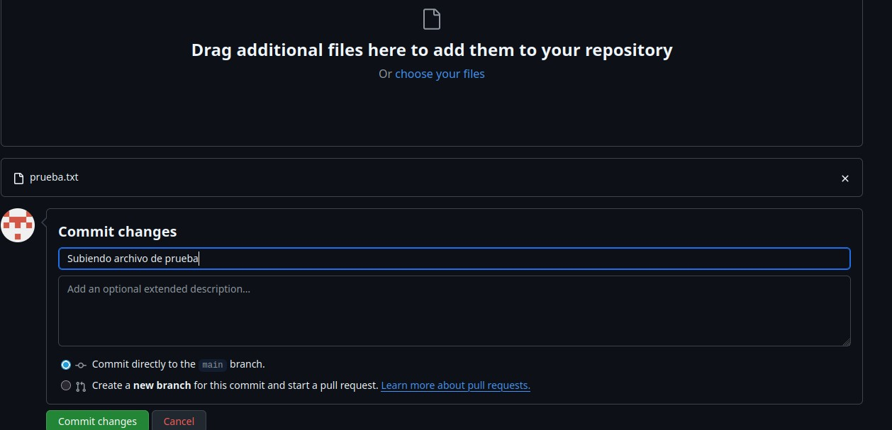
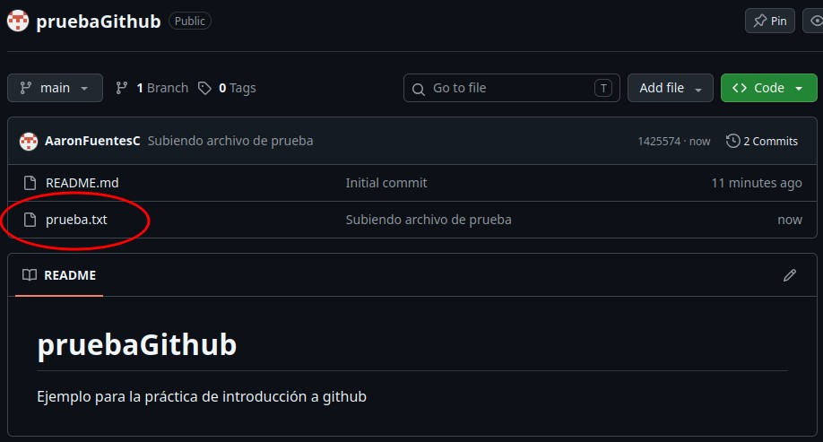
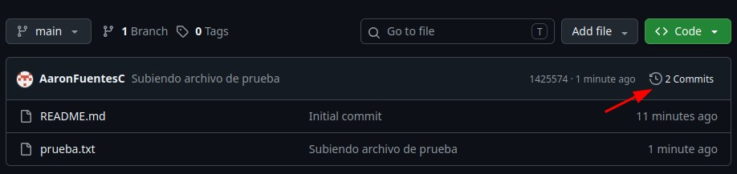
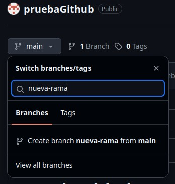

# Práctica de GitHub + Markdown
# Aarón Fuentes Casanova

## Introducción
Github es una plataforma online en la que los usuarios pueden almacenar ficheros, proyectos... Para lo que más se usa github es principalmete la gestión de versiones de diversos proyectos.
Además github permite que varias personas puedan trabajar en un mismo proyecto con muchas herramientas colaborativas. En esta práctica se van a observar cuales son las principales funcionaidades de github y como realizarlas.
Algunas de las funcionalidades que se van a observar en esta práctica son la creación de repositorios, cómo subir archivos a un repositorio, crear y administrar ramas en un repositorio y cambiar las preferencias de los repositorios.

## Cómo crear un repositorio
En este punto vamos a aprender como crear un repositorio de github. Para ello nos tenemos que dirigir al apartado repositorios y darle click al boton "Nuevo".

Después de esto vamos a poner los datos que queremos que tenga nuestro repositorio. 

Una vez que hemos rellenado los cambios vamos a dar click en el botón de crear el repositorio:

De esta forma hemos creado nuestro primer repositorio en GitHub

## Como subir archivos a GitHub

Una vez que ya tenemos creado el repositorio vamos a aprender a como subir archivos a un repositorio de github.

Estando dentro de nuestro repositorio tenemos que darle al botón que pone "Add File" y en este caso como vamos a subir un archivo vamos a seleccionar la opcion de upload files.

Una vez que le hemos dado click a subir archivos nos da la opción de subir los archivos que queramos desde nuestro ordenador. Para poder terminar de subirlo tambien tendremos que añadir un mensaje en el commit y darle al botón de commit changes:

Y una vez que ya hemos subido el archivo podemos verlo desde la página principal del repositorio:

Si queremos observar el historial de los commits que se han realizado, se puede hacer también desde la página principal del repositorio:

## Crear y administrar ramas

Una vez que hemos creado repositorios y archivos vamos a aprender a cómo crear y gestionar ramas.

Para crear una rama tenemos que dirigirnos a la página principal del repositorio, y a la izquierda donde pone "main" (que es la rama en la que estamos actualmente) y cuando escribamos el nombre de la rama que queremos crear tan solo le damos al botón de create branch.

Ahora vamos a hacer un pull request para añadir los cambios que he hecho en el fichero