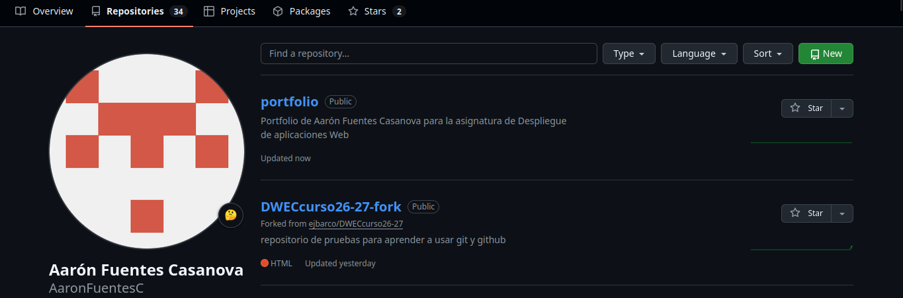
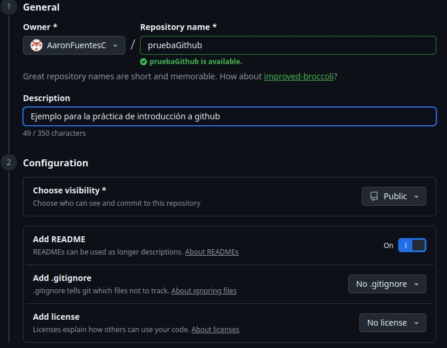

# Práctica de GitHub + Markdown
# Aarón Fuentes Casanova

## Introducción
Github es una plataforma online en la que los usuarios pueden almacenar ficheros, proyectos... Para lo que más se usa github es principalmete la gestión de versiones de diversos proyectos.
Además github permite que varias personas puedan trabajar en un mismo proyecto con muchas herramientas colaborativas. En esta práctica se van a observar cuales son las principales funcionaidades de github y como realizarlas.
Algunas de las funcionalidades que se van a observar en esta práctica son la creación de repositorios, cómo subir archivos a un repositorio, crear y administrar ramas en un repositorio y cambiar las preferencias de los repositorios.

## Cómo crear un repositorio
En este punto vamos a aprender como crear un repositorio de github. Para ello nos tenemos que dirigir al apartado repositorios y darle click al boton "Nuevo".

Después de esto vamos a poner los datos que queremos que tenga nuestro repositorio. 

Una vez que hemos rellenado los cambios vamos a dar click en el botón de crear el repositorio:

De esta forma hemos creado nuestro primer repositorio en GitHub
